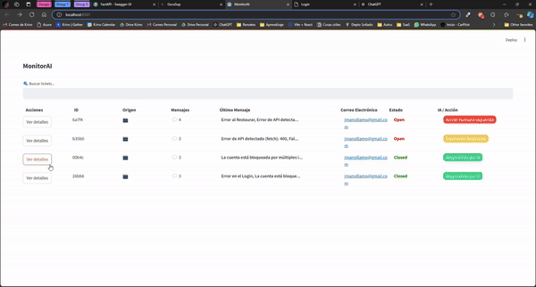

# Proyecto MonitorAI: Observabilidad + IA

Este proyecto facilita la comunicación entre los ejecutivos de soporte y los usuarios, reduciendo las barreras para reportar problemas. Permite a los usuarios informar sus inconvenientes en tiempo real, proporcionando información clara al ejecutivo de soporte.

No más búsquedas sin datos; la IA captura automáticamente la información necesaria y decide cómo proceder con el ticket.

Uso de Code GPT:
Principalmente se uso para apoyo de programación (sobre todo en streamlit)
## Arquitectura

La aplicación de Streamlit está disponible en el siguiente enlace:

[MonitorAI - Streamlit](http://192.241.152.4:8501/), donde puedes ver algunos casos de ejemplo.

Las APIs para entrenar el modelo están aquí:

[MonitorAI - FastAPI](http://192.241.152.4:4000/docs). Esta app FastAPI incluye funcionalidades para exponer archivos y generar APIs que permiten al agente tomar decisiones entre un conjunto finito de acciones.

## Demo

Puedes probar el widget descargando la carpeta **testweb** y abriendo el archivo **index.html**.

Deberías ver algo como esto:  

Cuando cargas el reporte, el análisis se ejecuta automáticamente y se visualiza en Streamlit:  

Finalmente, se muestra un análisis detallado de las acciones que tomó el asistente y su respuesta al usuario:  

